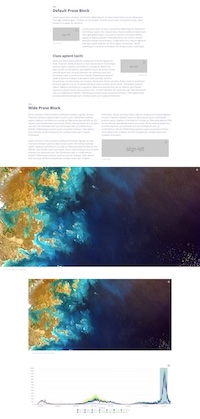
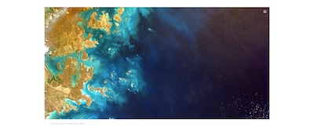

## How to write contents for Delta dashboard

### Prerequisites
This doc assumes that you already know how to write [Markdown](https://docs.github.com/en/get-started/writing-on-github/getting-started-with-writing-and-formatting-on-github/basic-writing-and-formatting-syntax), and are familiar with the concept of Component. 

### Block

`Block` is a basic building 'block' for mdx contents. Any contents on mdx docs needs to be wrapped with `Block` component. The type of Block, and the combination of its children element will decide the layout of the content block. There are the 8 kinds of Blocks that we offer. When there is a layout change, you can assume that there is a change of block type. The image below shows what kind of blocks were used for each layout.

<table>
<tr>
<td>

   
 </td>
 <td > 
 
    
  </td> 
</tr>
</table>


We currently (2022, March) have 8 types of Blocks for layout. Mind that only `Prose` and `Figure` can be direct children of Block. Any raw markdown contents can be wrapped with `Prose`, any media contents or custom components (Image, Map, Chart) should be wrapped with Figure. 

<table style="margin-top: 20px">
<tr>
<td> Type </td><td width='300px'> Syntax </td> <td> Result </td>
</tr>
<tr>
  <td> Default Prose Block </td>
  <td> 

  ```code
  <Block>
    <Prose>
      ### Your markdown header

      Your markdown contents comes here.
    </Prose>
  </Block>
  ```  
  </td> 
  <td>  

     
  </td>
</tr>

<tr>
  <td> Wide Prose Block </td>
  <td> 

  ```code
  <Block type='wide'>
    <Prose>
      ### Your markdown header

      Your markdown contents comes here.
    </Prose>
  </Block>
  ```  
  </td> 
  <td>  

  
  </td>
</tr>

<tr>
  <td> Wide Figure Block </td>
  <td> 

  ```
  <Block type='wide'>
    <Figure>
      <Image ... />
      <Caption ...> caption </Caption>
    </Figure>
  </Block>
  ```

  </td> 
  <td>  

  
  </td>
</tr>

<tr>
  <td> Full Figure Block </td>
  <td> 

  ```code
  <Block type='full'>
    <Figure>
      <Image ... />
      <Caption ...> caption </Caption>
    </Figure>
  </Block>
  ```
  </td> 
  <td>  

  
  </td>
</tr>

<tr>
  <td> Prose Figure Block </td>
  <td> 

  ```
  <Block>
    <Prose>
      My markdown contents
    </Prose>
    <Figure>
      <Image ... />
      <Caption> ... </Caption>
    </Figure>
  </Block>
  ```
  </td> 
  <td>  
  
  
  </td>
</tr>


<tr>
  <td> Figure Prose Block </td>
  <td> 

  ```
  <Block>
    <Figure>
      <Image ... />
      <Caption> ... </Caption>
    </Figure>
    <Prose>
      My markdown contents
    </Prose>
  </Block>
  ```
  </td> 
  <td>  

  
  </td>
</tr>

<tr>
  <td> Prose Full Figure Block </td>
  <td> 

  ```
  <Block type='full'>
    <Prose>
      My markdown contents
    </Prose>
    <Figure>
      <Image ... />
      <Caption> ... </Caption>
    </Figure>
  </Block>
  ```
  </td> 
  <td>  

  
  </td>
</tr>

<tr>
  <td> Full Figure Prose Block </td>
  <td> 


  ```
  <Block type='full'>
    <Figure>
      <Image ... />
      <Caption> ... </Caption>
    </Figure>
    <Prose>
      My markdown contents
    </Prose>
  </Block>
  ```
  </td> 
  <td>  

  
  </td>
</tr>
</table>


### Image 

You can use `Image` component to display any kind of image. Depending on where Image is used (is it inside of `Prose` as an inline image? or inside of `Figure`?), there are additional attributes you need to pass. 

Also you can pass any attribute that you can use with `` HTML element and these will get passed down. Ex. you can pass width of image or height of image with `width`, `height`.

| Option | Type | Default | Description|
|---|---|---|---|
| src | string | '' | Path for image. If using local image, please look at the section below. |
| alt | string | '' | Description for image, this will be used for screen readers. |
| align | string, enum (left, right, center) | 'center' | <b>For inline image.</b> Alignment of image. |
| attr | string | '' | <b>For inline image.</b>  Caption text for inline image. |
| attrAuthor | string | '' | Info for image author. When omitted, attribution mark on right top wouldn't show up. |
| attrUrl | string | '' | Link for image attribution. |

#### Inline image

Syntax for an inline Image, left aligned, embedded in Prose will look like below.

```
  <Image 
    src="http://via.placeholder.com/256x128?text=align-left" 
    alt="Media example" 
    align="left" 
    attr="example caption" 
    attrAuthor="example author"
    attrUrl="https://example.com"
    width="256"
  />
```

#### Figure Image with Caption

You can replace `attr` option with `<Caption>` component if your image is used in `Figure` block. In this way, you can display rich text as Caption. 

Syntax for `Image` component with  `<Caption>` is like below.


```
  <Figure>
    <Image
      src='https://picsum.photos/id/1002/2048/1024'
      alt='description for image'
    />
    <Caption 
      attrAuthor='Development Seed' 
      attrUrl='https://developmentseed.org'
    >
      This is an image. This is <a href="link">the link</a>.
    </Caption> 
  <Figure>
```

#### How to use local image

WIP

### Chart

| Option | Type | Default | Description|
|---|---|---|---|
| dataPath | string | '' | Path for data. The data should be either in `csv` or `json` format. |
| xKey | string | '' | Attribute to be used for x axis. |
| yKey | string | '' | Attribute to be used for y axis |
| idKey | string | '' | Attribute for each data point |
| dateFormat | string | '' | Template for how temporal date is formatted. This follows [d3's convention for date format](https://github.com/d3/d3-time-format#locale_format) |
| highlightStart | string | '' | Start point for x axis to draw highlighted area. |
| highlightEnd | string | '' | End point of x axis to draw highlighted area.
| highlightLabel | string | '' | Label for highlighted area. |

Syntax for Chart used in Wide Figure Block looks like this

```
<Block type='wide'>
  <Figure>
    <Chart
      dataPath='example.csv'
      dateFormat="%m/%d/%Y" 
      idKey='County' 
      xKey='Test Date' 
      yKey='New Positives' 
      highlightStart = '12/10/2021'
      highlightEnd = '01/20/2022'
      highlightLabel = 'Omicron'
    />
    <Caption 
      attrAuthor='attribution for wide figure block, chart' 
      attrUrl='https://developmentseed.org'
    /> 
  </Figure>
</Block>

```


### Map

## Some gotchas

- Do not use h1(`#h1`) for your header.