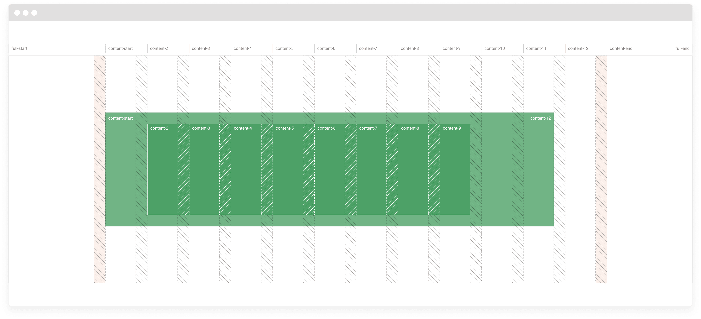

# 🤗 Human Universal Gridder (Hug)

The Human Universal Gridder (Hug) is a layout component with two main purposes:

1. Create a grid that remains centered on the page and has leading and trailing columns of varying size.
2. Handle subgrids when a Hug is nested within another Hug.


The image above shows the grid that gets created when a Hug is used. The number of columns varies according to the screen size:
- Small screens: 4 columns
- Medium screens: 8 columns
- Large screens: 12 columns

**Hug responsiveness in action:**  

https://user-images.githubusercontent.com/1090606/156192701-350da28a-7bf4-4129-a50b-303ca3a90304.mp4

<details>
  <summary>Code</summary>

```js
const ExampleHug = styled(Hug)`
  margin-top: 5rem;

  > p {
    overflow: hidden;
    padding: 5rem 0;
    text-align: center;
    background: blanchedalmond;
  }

  .leading {
    grid-column: full-start/content-start;
  }

  .gridder {
    grid-column: content-start/content-end;
    background: aliceblue;
  }

  .trailing {
    grid-column: content-end/full-end;
  }
`;

<ExampleHug>
  <p className='leading'>Leading Column</p>
  <p className='gridder'>Universal Gridder</p>
  <p className='trailing'>Trailing Column</p>
</ExampleHug>
```
</details>

As you can see from the video, the grid will always be centered on the page (with a maximum width bound to the theme property `layout.max`), the leading/trailing columns will take up the rest of the space and will shrink until they disappear.  
The centered grid will also always have a buffer from the side of the page which is something that does not exist in a traditional css grid.

This approach allows the creation of complex and interesting element placement. An example is a block that would be "bleeding" out of the page content (common with images).


The underlying tech of the Human Universal Gridder is a normal css grid, albeit one with some complex calculations.  
We're taking advantage of the ability of naming grid lines in css' `grid-template-columns`, to allow you to easily define start and end positions. Therefore whenever an element is placed inside a Hug you have to define the grid placement of this element using css: `grid-column: <start>/<end>`.

If you need a refresher on css grids check [Css Trick's A Complete Guide to Grid](https://css-tricks.com/snippets/css/complete-guide-grid/).

You have to use the actual line names with Hug as something like `span 2` will cause unexpected behaviors.  
You can check the [image at the beginning](./media/grid.png) for a visual understanding of the grid lines, but here's the full list:
```
full-start
content-start
content-2
content-3
content-4
content-5
content-6
content-7
content-8
content-9
content-10
content-11
content-12
content-end
full-end
```

_**Note**: Even though the line name `content-1` does not exist, it is the same as `content-start`. We considered it a better expertience to have consistent start and end names for the content (`content-start`/`content-end`)._  

_**Caveat**: Lines `content-5` though `content-12` will exist depending on the media query. For example, for small screens you'll have `full-start`, `content-start`, `content-2`, `content-3`, `content-4`, `content-end`, `full-end`._

## Nested Hug

The beauty of the Hug really shines where they are nested.



Whenever you nest a Hug inside another, you also have to specify the grid placement, but instead of doing it with css, you must do it with a component prop (grid) and specify the grid position for the different media breakpoints. This is needed so that the subgrid calculations are done properly.  

A nested Hug will retain the same columns and spacing as its parent. For example, in the image above the element with a darker green, is placed in the grid lines `content-2` to `content-9`, and its grid is comprised of the subgrid with the same columns.

For context, the available breakpoints are `xsmallUp | smallUp | mediumUp | largeUp | xlargeUp`.

Example:
```jsx
<Hug>
  {/*
    This first element will start occupying the full grid (full-start/full-end),
    then at the mediumUp breakpoint will go from content-start to the end of the
    third column (grid line content-4), and on large screens will take up 3
    columns, from content-2 to content-5
  */}
  <Hug
    grid={{
      // Below the smallUp breakpoint full-start/full-end is used by default.
      smallUp: ['full-start', 'full-end'],
      mediumUp: ['content-start', 'content-4'],
      largeUp: ['content-2', 'content-5']
    }}
  >
    <p>Content</p>
  </Hug>
  <Hug
    grid={{
      smallUp: ['full-start', 'full-end'],
      // The mediumUp breakpoint is not defined, so the previous available one
      // (smallUp here) is used until we reach the next one.
      largeUp: ['content-6', 'full-end']
    }}
  >
    <p>Content</p>
  </Hug>
  <Hug grid={['full-start', 'full-end']}>
    <p>Always full-start/full-end</p>
  </Hug>
</Hug>
```
